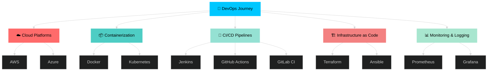

<!-- ⚙️ Rohit Desai | DevOps Engineer | Animated Professional GitHub Profile -->

<div align="center">

# 


<p align="center">
  <a href="https://linkedin.com/in/rohit-desai1855"></a>
  <a href="mailto:rdesai1855@gmail.com"></a>
  <a href="https://github.com/rd1855"></a>
</p>


</div>

---


##  About Me

```python
class DevOpsEngineer:
    def __init__(self):
        self.name = "Rohit Desai"
        self.role = "Aspiring DevOps Engineer"
        self.education = "B.E. in AI & Machine Learning"
        self.location = "India"
        self.interests = ["Cloud Computing", "Automation", "CI/CD", "Infrastructure as Code"]
        
    def current_focus(self):
        return {
            "learning": ["AWS", "Docker", "Kubernetes", "Jenkins", "Terraform"],
            "working_on": "90DaysOfDevOps Challenge",
            "philosophy": "Automate. Optimize. Deploy. Repeat."
        }
    
    def say_hi(self):
        print("Thanks for visiting! Let's build something amazing together 🚀")

me = DevOpsEngineer()
me.say_hi()
```


##  Tech Arsenal

<div align="center">

### ☁️ DevOps & Cloud Technologies


| Category | Technologies |
|----------|-------------|
| **Cloud Platforms** |   |
| **Containerization** |   |
| **CI/CD** |    |
| **Infrastructure** |   |
| **Monitoring** |   |
| **Operating Systems** |   |

### 💻 Development Stack


### 🛠️ Tools & IDEs


</div>


##  GitHub Statistics

<div align="center">
<table>
<tr>
<td width="50%">


</td>
<td width="50%">


</td>
</tr>
<tr>
<td width="50%">


</td>
<td width="50%">

### 📈 Contribution Stats


**Total Contributions:** 

</td>
</tr>
</table>
</div>


##  GitHub Trophies

<div align="center">


</div>


##  Featured Projects

<div align="center">
<table>
<tr>
<td width="50%">

### 🚀 90 Days of DevOps Challenge
[](https://github.com/rd1855/90DaysOfDevOps)

**Journey through DevOps fundamentals**
- 📚 Learning Docker, Kubernetes, CI/CD
- 🛠️ Hands-on projects and automation
- 📝 Daily progress documentation

</td>
<td width="50%">

### 💡 Your Next Project
[](https://github.com/rd1855)

**Pin your best work here!**
- ⭐ Replace with your actual repo
- 🔧 Showcase your DevOps skills
- 🚀 Inspire others

</td>
</tr>
</table>
</div>


##  Contribution Activity

<div align="center">

### 📊 Contribution Graph

[](https://github.com/rd1855)

### 🐍 Contribution Snake Animation


> **Want your own snake?** Create `.github/workflows/snake.yml`:

<details>
<summary>📝 Click for Snake Setup Code</summary>

```yaml
name: Generate Snake Animation

on:
  schedule:
    - cron: "0 0 * * *"
  workflow_dispatch:
  push:
    branches:
    - main

jobs:
  generate:
    permissions: 
      contents: write
    runs-on: ubuntu-latest
    timeout-minutes: 5
    
    steps:
      - name: Generate github-contribution-grid-snake.svg
        uses: Platane/snk/svg-only@v3
        with:
          github_user_name: ${{ github.repository_owner }}
          outputs: |
            dist/github-contribution-grid-snake.svg
            dist/github-contribution-grid-snake-dark.svg?palette=github-dark
        env:
          GITHUB_TOKEN: ${{ secrets.GITHUB_TOKEN }}
          
      - name: Push to output branch
        uses: crazy-max/ghaction-github-pages@v3.1.0
        with:
          target_branch: output
          build_dir: dist
        env:
          GITHUB_TOKEN: ${{ secrets.GITHUB_TOKEN }}
```

Then update the image URL to: `https://raw.githubusercontent.com/rd1855/rd1855/output/github-contribution-grid-snake-dark.svg`

</details>

</div>


##  Current Learning Roadmap

<div align="center">



</div>


##  Latest DevOps Activity

<!--START_SECTION:activity-->
1. 🎉 Merged PR [#1](https://github.com/rd1855/90DaysOfDevOps/pull/1) in [rd1855/90DaysOfDevOps](https://github.com/rd1855/90DaysOfDevOps)
2. 💪 Opened PR [#1](https://github.com/rd1855/90DaysOfDevOps/pull/1) in [rd1855/90DaysOfDevOps](https://github.com/rd1855/90DaysOfDevOps)
3. 🗣 Commented on [#1](https://github.com/rd1855/90DaysOfDevOps/issues/1) in [rd1855/90DaysOfDevOps](https://github.com/rd1855/90DaysOfDevOps)
<!--END_SECTION:activity-->


##  Support My Journey

<div align="center">

**If you find my DevOps journey inspiring, consider buying me a coffee!** ☕

<a href="https://www.buymeacoffee.com/rd1855" target="_blank">
  
</a>

<br><br>

**Or connect with me on:**

[](https://linkedin.com/in/rohit-desai1855)
[](https://twitter.com/rd1855)
[](mailto:rdesai1855@gmail.com)
[](https://github.com/rd1855)

</div>

---

<div align="center">
  
###  *"Automate. Optimize. Deploy. Repeat."* 


**DevOps is not a job — it's a culture** ⚙️


</div>
